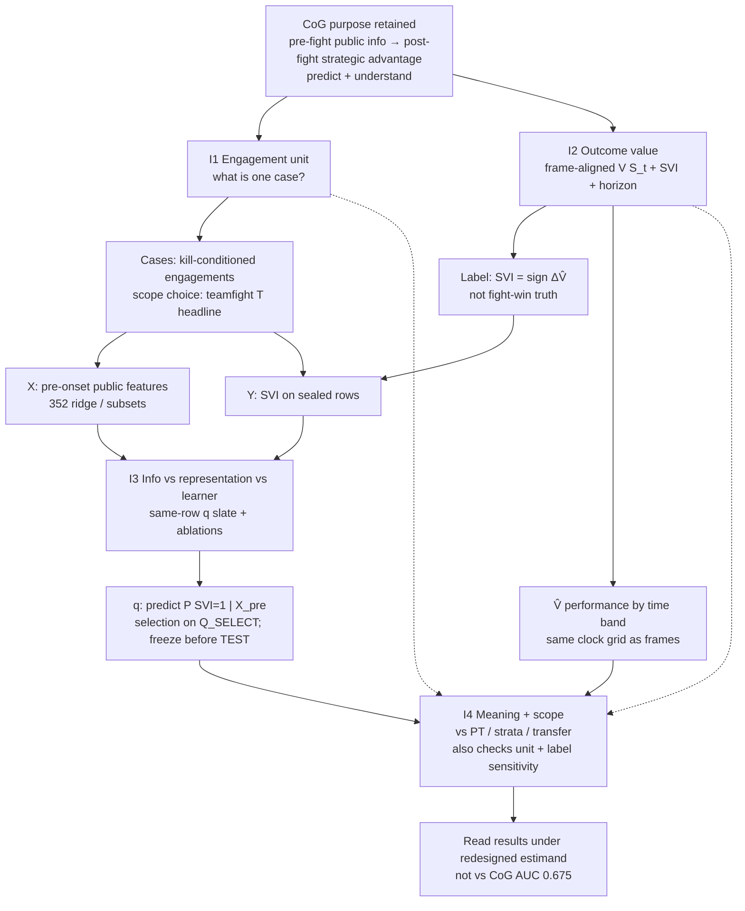
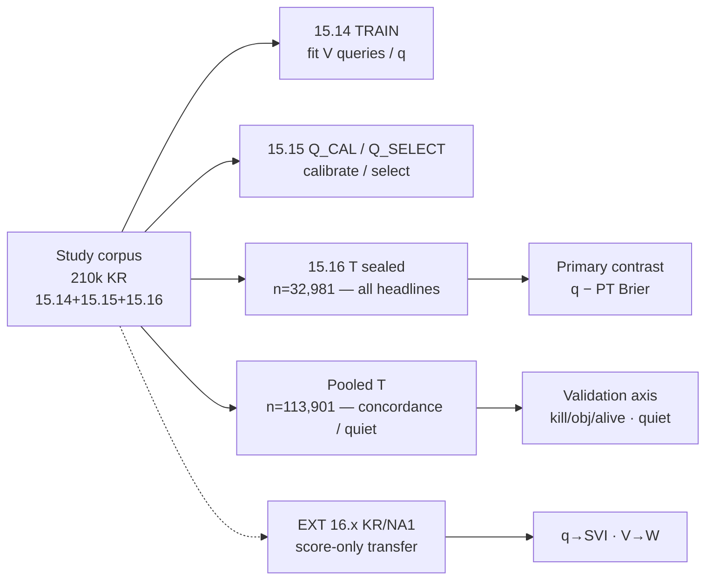
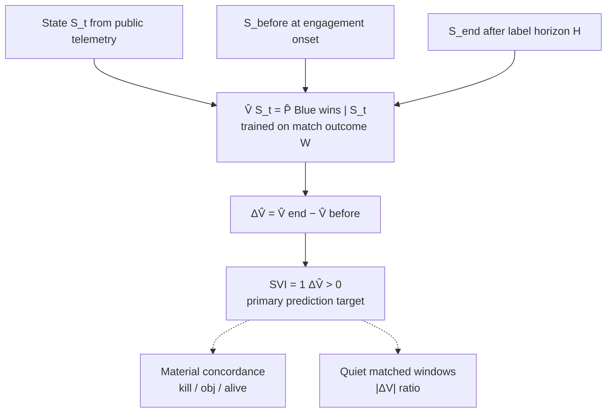
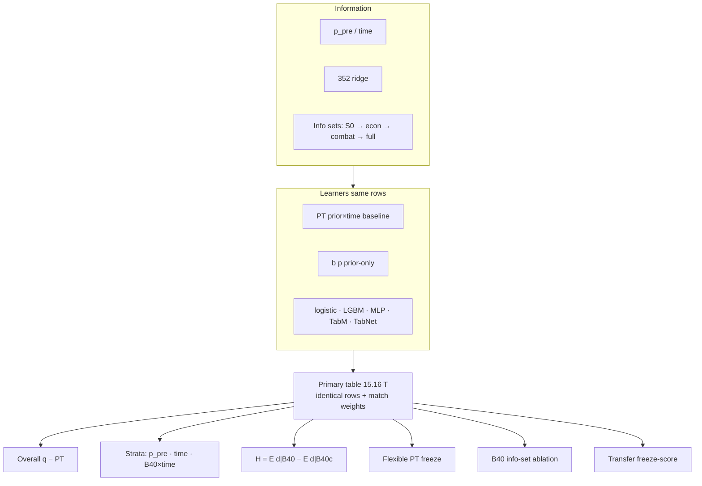
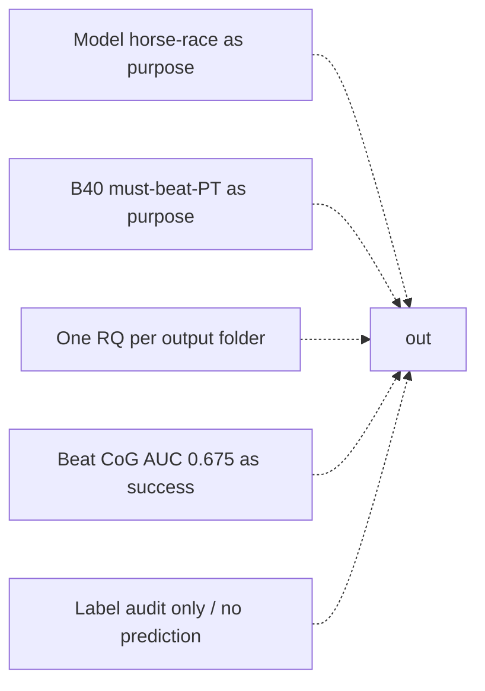

# Experiment design map — CoG succession (2026-09-19)

**Authority:** [COG_SUCCESSION_LOCK_20260919.md](COG_SUCCESSION_LOCK_20260919.md)  
**Facts inventory:** [EXPERIMENT_INVENTORY_COHORT_20260919.md](EXPERIMENT_INVENTORY_COHORT_20260919.md)  
**Sample rules:** [PAPER_COHORT_CONTRACT_20260919.md](PAPER_COHORT_CONTRACT_20260919.md)

Intro RQ wording is **deferred**. This map places **pipeline stages** and **I1–I4 checks**; it does not promote every output folder to a research question.

---

## 1. Purpose → pipeline → checks

*Execution note (not a design node):* current frozen primary \(q\) = LightGBM from Q_SELECT / sealed incremental_q winner.
---

## 2. Data and evaluation layers (contract)

---

## 3. Estimand construction (I2 center)

---

## 4. Prediction and meaning checks (I3 + I4)

**Role of PT / B40:** not the project motive — checks of *how much forecast skill is reading pre-fight lead*.

---

## 5. Experiment placement under I1–I4

| Stage | Role | Artifacts (inventory) | Status |
|---|---|---|---|
| **I1 Unit** | Justify cases / scope T | Detector docs; T vs N; definition sensitivity (if/when run) | Partly prior docs; sensitivity not full paper lock |
| **I2 Outcome** | Warrant for SVI | **V redesign first** (shared time-conditional); then concordance / quiet / ΔV | **In progress** — [V_REDESIGN_CONTRACT](V_REDESIGN_CONTRACT_20260919.md); old band ledger kept |
| **I3 Info–learner** | Separate info vs model | Primary table; reselection; lean TabM; Tier B; B40 ablation | Done |
| **I4 Meaning–scope** | Prior-lead dependence + transfer | PT/\(b(p)\); lift localization; \(H\); flex PT; EXT transfer | Done |
| **Contract** | Same corpus ≠ same eval sample | Cohort contract; phase1 sealed audit | Done |

---

## 6. What this design is *not*

Center remains: **forecast post-engagement advantage from pre-engagement public info**, with stronger unit/outcome warrants and stricter evaluation.

---

## 7. Next after this map

1. Confirm which **I1** sensitivity / scope claims enter the paper (vs appendix / prior detector papers).  
2. Write Intro RQs **per manuscript branch** from the succession sentence — see [COMMON_RESEARCH_SPINE_20260919.md](COMMON_RESEARCH_SPINE_20260919.md):  
   - Journal: J-RQ1–3 ([JOURNAL_RESEARCH_PLAN_20260919.md](JOURNAL_RESEARCH_PLAN_20260919.md))  
   - Master: M-RQ1–4 ([MASTER_THESIS_RESEARCH_PLAN_20260919.md](MASTER_THESIS_RESEARCH_PLAN_20260919.md))  
3. Shared runs once; placement in [SHARED_EXPERIMENT_MATRIX_20260919.md](SHARED_EXPERIMENT_MATRIX_20260919.md).  
4. Paper spine: Methods follow I1→I2→I3→I4; Results report prediction under that estimand, then meaning/scope checks.
