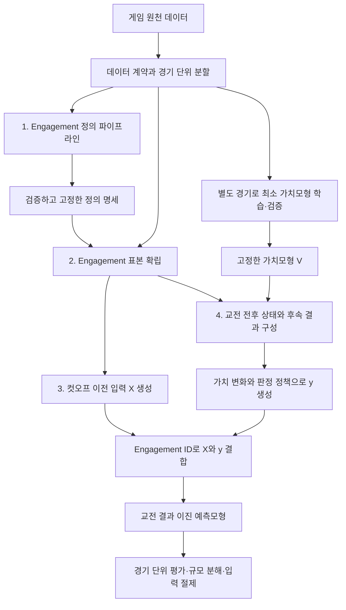

# Engagement 예측 프레임워크 청사진

2026-09-09 논의안. 현재 구현 완료를 뜻하지 않는다. 기존 정의·특징·평가 파이프라인 위에 최소 가치평가 기반 라벨 모듈을 제안한다. 버그 수정 중인 대상 저장소는 변경하지 않는다.

## 연구 목표와 범위

공개 게임 데이터에서 engagement를 정의하고, engagement 이전 관측으로 해당 교전 및 후속 구간의 결과를 예측한다. 이번 논문의 중심은 정의·표본·입력·출력·평가를 연결하는 절차와 LoL 실증이다. 범용 가치평가 모델 자체의 개발과 게임 간 전이는 후속 연구다.

이번 출력의 정확한 의미는 채택한 가치모형에서 블루의 가치가 증가하는 결과의 확률이다. 이는 객관적인 모든 의미의 한타 승리나 교전의 인과적 효과와 동일하지 않다.

## 전체 구조

원천 데이터의 최종 경기 승패는 가치모형 학습의 정답으로만 사용한다. 미래 상태와 최종 승패가 교전 예측 입력 X에 들어가는 경로는 없다.

## 0. 데이터 계약과 분할

- 각 데이터의 시간, 개체, 소속, 관측 시점, 사건 의미, 패치를 정리한다.
- 정의 개발, 가치모형 개발, 교전 예측 평가에 사용할 경기의 역할을 사전에 지정한다.
- 최소한의 구현에서는 가치모형용 경기를 별도로 확보하고 그 모델을 동결한 후, 나머지 경기에서 교전 예측의 학습/검증/평가를 수행한다. 표본 효율을 위한 nested cross-fitting은 별도 설계가 필요하며 단순 OOF라는 말로 대체하지 않는다.
- 정의·라벨 정책을 최종 평가 경기의 결과를 보고 조정하지 않는다. 현재 전체 코퍼스에서 탐색한 결과와 향후 확인 평가를 구분한다.

## 1. Engagement 정의 파이프라인

입력: 정의 개발용 사건·위치 자료, 게임 규칙 근거, 문헌에서 차용한 방법.

처리: 시간/공간 경계 추정, 존재 조건의 운영점 명시, 병합/종료/제외 규칙, 감도 및 외부 타당도 검증.

출력: 버전이 있는 EngagementSpec. 경계, 게이트, 정리 규칙, 표본 범위, 출처, 적용 가능한 패치를 포함한다.

LoL 현재 후보는 G=13.7s, D=4264u, R=1600u, B=15s, M=2이다. 값과 실제 표본 선택의 정확성을 구분한다. 특히 all-participant kill anchor 보간은 독립 검증 대상이다.

## 2. Engagement 표본 확립

고정 spec으로 개별 engagement를 식별한다. 이는 정의를 다시 추정하는 단계가 아니다.

EngagementRecord에는 engagement_id, match_id, patch, 첫/마지막 사건, 관련 사건 ID와 참여자, 예측 cutoff tau, 결과 측정 끝 T, 규모 등 사후 평가용 속성을 기록한다.

관측창/결과창 설정은 별도 프로토콜 명세에 둔다. 참여 규모는 사후 분석용이며 사전 입력과 구분한다. 라벨별 무승부/불확실성으로 제거하기 전의 공통 표본 모집단을 보존한다.

현재 kill-conditioned 표본은 사후 선택이다. 실시간 발생 탐지기를 구현했다는 주장은 하지 않는다.

## 3. 교전 예측 입력 확립

X = F(관측 이력 [tau-W, tau], 고정 정보, 허용된 지도 정보).

입력 채널: 고정 정보, 상태 스냅숏, 사건 이력, 지도/구조물 상태, 관측 신선도. 시간 경계의 포함 여부와 사용한 프레임 시각을 구현·명세에서 통일한다.

FeatureSpec에 원천 필드, 이용 가능 시각, 단위, 변환, 결측 처리, 열 이름/차원, 범주형 처리, 채널을 기록한다. 선택용 사후 보간 위치·미래 파괴·경기 전체 길이·사후 규모가 들어가지 않는지 검사한다.

관측창 30초는 현재 후보이며 최종 정보 계약 확정 후 동결한다.

## 4. 가치평가에 따른 출력 확립

이번 연구에서는 단순 로지스틱 회귀를 첫 기준 후보로 둔다. 채택·검증 완료 상태는 아니다.

V(S_t) = P(블루의 최종 경기 승리 | t까지 관측된 상태).

가치모형의 상태 입력 S와 교전 예측기의 X는 별도 스키마다. S는 시점별 상태 평가에 필요한 최소 특징, X는 교전 이전 관측창의 특징이다. S의 구체적인 필드 목록은 아직 미확정이다.

pre = tau를 기본 후보로 놓고, after = T는 교전 및 후속 결과를 포함하도록 정한다.

deltaV = V(S_T) - V(S_tau).

이는 해당 구간의 가치 변화다. 지도 전체 상태를 평가하면 원거리 사건 영향도 포함되므로 출력 명칭과 귀속 범위를 일치시켜야 한다. “교전으로 인해 발생한 순수 효과”로 해석하지 않는다.

60초 프레임과 임의 ms 측정 시점의 불일치를 별도 해결해야 한다. 전후가 같은 프레임을 읽을 수 있고, 이후 프레임을 쓰면 결과창이 길어질 수 있다. 시점 오차를 기록하고 평가한다.

LabelPolicy 예시:
- deltaV > epsilon: 블루 가치 증가, y=1.
- deltaV < -epsilon: 레드 방향 가치 변화, y=0.
- 그 사이: 대등/불확실 마스크. 이진 학습 포함 여부는 별도 확정한다.

epsilon은 아직 정하지 않았다. 무조건 0 또는 임의 값을 확정하지 않고, 가치모형의 오차·학습 재표집에 따른 판정 안정성·표본 포함률을 점검한다. 대등과 불확실은 기록상 구분한다.

LabelRecord에는 V_pre, V_post, deltaV, y, 제외 이유, 모델 버전, 실제 상태 시각을 저장한다. CoG 및 market_event 라벨을 비교용으로 보존한다. 최종 승패를 입력으로 넣거나 기존 교전 예측 AUC를 최대화하도록 가치모형을 고르지 않는다.

## 5. 교전 예측과 평가

X와 y를 engagement_id로 결합하고 경기 단위 분할을 유지한다. 교전 예측기는 p = P(y=1 | X)를 출력한다.

이번 연구의 주 평가:
- AUC와 확률 품질(Brier, calibration).
- 참여 규모·패치·게임 단계별 분해.
- 고정/스냅숏/사건/지도/신선도 채널 절제.
- 가치라벨·CoG·사건 골드 라벨의 공통 표본 비교와 라벨별 포함률.
- 정의/입력/라벨 버전과 샤드 무결성 확인.

가치모형의 성능과 교전 예측기의 성능을 별도 보고한다. 나쁜 가치모형의 라벨을 잘 예측하는 경우를 성공으로 판정하지 않는다.

평가 시점의 역할:
- 사후 데이터는 표본 선택·정답 생성·평가에 사용.
- 사전 예측에는 X와 동결된 교전 예측기만 필요.
- 사후적으로 선택된 engagement 표본에 대한 성능과 실시간 전체 시점에서의 성능을 혼동하지 않음.

## 현재 상태와 다음 결정

정의/표본/특징/기존 라벨/교전 평가 코드는 이미 존재하지만 감사에서 확인한 결함과 계약 불일치를 수정 중이다. 가치모형 기반 라벨은 이번 대화의 새 제안으로 구현 완료가 아니다. 일반적인 다중 게임 가치모형과 M0/M1/M2 확장은 이번 핵심 범위에서 제외한다.

가장 먼저 확정할 세 항목:
1. 가치평가 상태 S의 최소 입력과 최종 승패 학습용 경기 분할.
2. pre/after 측정 시점, 후속 결과창, 실제 프레임 처리.
3. deltaV의 이진 변환과 대등·불확실 표본 정책.

전체 프레임워크를 최종 확정했다기보다, 모듈 경계와 이번 논문의 범위를 정리한 청사진이다.
