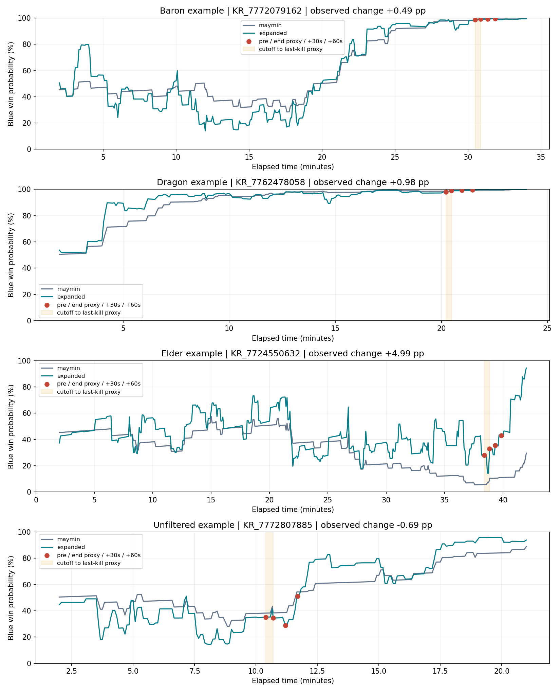

# 독립 시간별 승률 모델과 교전 전후 변화: v2

실행일: 2026-09-09. 브랜치: `codex/engagement-state-value`.

## 연구 질문과 현재 도달점

연구의 중심은 engagement를 데이터에서 정의하고, 교전 전에 그 결과를 예측하는 것이다.
결과의 가치는 **같은 독립 승률 모델이 평가한 교전 전후 확률 차이**로 표현한다.
승률 모델 자체의 고도화는 이번 논문의 부수 과제로 둔다.

이번 실행은 독립 승률 모델 학습과 관측 교전 변화량 산출까지다. 변화량을 예측하는
engagement 모델은 아직 새 목표로 학습하지 않았다. 과거 최종 경기 승패 스태킹 실험은
별도 탐색 기록이며 이번 연구 질문의 성공·실패 판정에 사용하지 않는다.

승률 모델은 최종 경기 승패 `W ∈ {0,1}`를 교사 신호로 배우되, 입력은 시점별로 달라진다.

```
V(S_t) = P(최종 Blue 승리 | t까지 관측된 경기 상태)
ΔV_immediate = V(S_last_kill) − V(S_pre)
ΔV_30 / ΔV_60 = V(S_last_kill+30s / +60s) − V(S_pre)
```

따라서 한 경기의 최종 승패는 한 번 결정되지만, 조건부 승리 확률은 경기 중에 계속 달라질 수 있다.
양의 Δ는 Blue, 음의 Δ는 Red의 승리 확률 증가를 뜻한다. 0은 동률로 남긴다.
확률의 차이는 %p로 보고한다. 관측된 변화는 한타의 순수 인과효과가 아니다.

## 선행연구와 우리 설계의 경계

| 구분 | 근거와 실제 적용 |
|---|---|
| 승률 모델 원형 | [Maymin (2021), JQAS](https://d-nb.info/1367424143/34) §3.2: 시간 및 양 팀 킬·타워·대형 몬스터 7개 입력 로지스틱, 경기당 무작위 한 시점. 구조를 재학습했으며 원래 가중치의 재현은 아니다. |
| 확률 검증의 필요 | [Kim et al. (2020), IEEE CoG](https://ieee-cog.org/2020/papers/paper_221.pdf): 승자 분류와 확률 보정의 구별. 해당 MLP나 data-uncertainty loss를 재현하지 않았다. |
| 보정 및 전후 차이의 참고 | [Ferreira & Faganeli Pucer (2025), SCORES 학생 심포지엄](https://zalozba.fri.uni-lj.si/SCORES2025.pdf#page=61): 별도 자료에서 보정하고 전후 승률 차이를 측정. XGBoost·SHAP 구현을 계승한 것은 아니다. |
| 가치와 행동 평가의 분리 | [Jalovaara (2024), Aalto 석사학위논문](https://sal.aalto.fi/publications/pdf-files/theses/mas/tjal24a_public.pdf) §4.3: 상태 가치의 차이로 WPA를 정의. 우리의 교전 경계와 동일하지 않다. |
| 우리 확장 | 기존 상태 표현 중 361개 입력의 정규화 로지스틱. 바론·장로·드래곤 종류·영혼 등 사건 이력을 구분한다. 이 세부 입력 설계를 위 논문들이 검증했다고 주장하지 않는다. |
| 우리 측정 계약 | 기존 cutoff 직전, 클러스터 마지막 킬, 그로부터 30초·60초를 별도 측정한다. 마지막 킬은 실제 전투 종료의 관측값이 아니라 대용 경계다. |

수동으로 '바론=몇 점' 같은 보상을 합산하지 않고 최종 승패에서 계수를 학습한다.
그러나 입력 선택·모형 구조·시간 구간에는 연구자의 선택이 남는다. 임의성을 없앴다고
주장하지 않고, 비교 모델과 민감도 검토가 가능한 명시적 설계로 제한한다.

## 데이터와 독립성

이미 구축한 49,677경기의 50k 탐색 자료에서 기존 분할을 유지했다.
승률 모델에는 교전 표본이나 교전 결과 라벨을 넣지 않고, 독립적인 분 단위 상태 그리드만 사용했다.

| 역할 | 경기 수 | 용도 |
|---|---:|---|
| fit | 7,004 | 기본 모형 학습, 확장형 C의 내부 3-fold 선택 |
| calibration | 1,501 | sigmoid / isotonic 보정기 학습 |
| selection | 1,502 | 계열별 후보의 log loss 비교 |
| test | 4,986 | 고정 모형의 승률 평가·시간 곡선 |
| engagement | 9,844 | 별도 경기에서 기존 교전 전후 변화 측정 |

앞 네 역할에서는 경기당 seed 기반 무작위 한 시점을 선택했다. 역할 간 경기 중복은 없다.
원형은 raw, 확장형은 sigmoid 보정이 선택됐다. 시험·교전 계산 전에 모형 파일과 hash를 고정했다.
이 자료는 앞선 실험에서 탐색했으므로 완전히 새로운 외부 시험 자료라고 부르지 않는다.
원천 그리드가 2분부터여서 0–2분의 성능도 주장하지 않는다.

## 완료 결과

v2 학습·계산은 약 310초에 정상 종료했다. 별도 산출물 감사도 통과했다.

경기당 무작위 한 시점, 시험 4,986경기의 결과다. AUC는 클수록, Brier와 log loss는 작을수록 좋다.

| 모델 | AUC | Brier | Log loss |
|---|---:|---:|---:|
| 학습 집합 승률 상수 | 0.5000 | 0.2498 | 0.6928 |
| Maymin 구조 재학습 | 0.8272 | 0.1701 | 0.5098 |
| 오브젝트 구분 확장형 + sigmoid | 0.8468 | 0.1594 | 0.4780 |

전체 분 단위 시험 곡선을 시간대로 나눈 확장형 AUC는 2–10분 0.6768, 10–20분 0.8525,
20–30분 0.9429, 30분 이후 0.9200이다. 같은 시간대 안에서 경기별 총 가중치를 같게 했다.
초반 2–10분은 원형(AUC 0.6802)보다 좋지 않았다. 전체 지표만으로 모든 시간대가
충분히 검증됐다고 해석하지 않는다. 반복 시점은 독립 경기 표본 수가 아니며 신뢰구간은 산출하지 않았다.

9,844경기 중 기존 교전 모집단에 해당하는 **9,198경기, 26,712개 교전**을 측정했다.
즉시 경계 조건으로 추가 제외된 행은 없었다. 종료/마지막 관측 이후의 후속 시점은 결측으로 남겼다.

| 확장형 출력 | 유효 교전 수 | 절대 변화량 중앙값 | Blue 방향 평균 변화 |
|---|---:|---:|---:|
| pre → 마지막 킬 대용 경계 | 26,712 | 8.56%p | −1.88%p |
| pre → 마지막 킬 +30초 | 26,095 | 8.58%p | +0.36%p |
| pre → 마지막 킬 +60초 | 25,350 | 9.13%p | +0.21%p |

이 표는 교전당 동일 가중치의 기술 통계다. 평균의 부호는 팀 색상 기준일 뿐 한타의 유익함을
뜻하지 않는다. 특히 즉시 구간에서 Blue 평균이 음수인 점은 경계 조건과 사건 시점의
모형 편향을 추가 점검할 이유이며, Red의 인과적 이득으로 해석하지 않는다.
원형과 확장형의 즉시 변화 **방향 일치율은 85.92%**로, 출력 방향의 모델 의존성이 남아 있다.

pre→마지막 킬 구간 내 오브젝트 획득이 관측된 창은 바론 225개, 드래곤 1,060개,
장로 18개, 영혼 이벤트 63개다. 항목 간 중복이 가능하며 획득 총횟수가 아니다.
특히 장로 18개로 장로 가치의 안정성을 확정할 수 없다. +30/+60 구간의 획득 건수는
이 집계에 포함되지 않지만, 해당 시점 상태를 평가하는 확률에는 관측 사건 이력이 들어간다.

그림의 장로 사건 포함 사례 `KR_7724550632:2304974`에서는 Blue 확률이
28.02% → 33.01% → 35.45% → 43.13%로 변했다. 전후 차이는 각각
+4.99%p, +7.43%p, +15.11%p다. 장로만의 효과를 분리한 수치가 아니며,
범주별 ID hash로 선택한 설명용 사례다. 큰 변화량을 기준으로 고른 사례가 아니다.



원천 상태를 5초 간격 및 사건 시점에서 다시 조회해 그렸다. 분 단위 예측의 보간값을
사건 시점의 관측값으로 사용하지 않았다. 다만 더 촘촘히 조회해도 원천 스냅숏의 해상도는 늘어나지 않는다.
교전 pre/end 조회의 원천 프레임 경과 시간은 중앙값 32.33초, 90백분위 53.82초,
최대 60.04초다.

감사에서는 14,993경기의 무작위 시점 선택, 분할 무중복, 소스·모형 hash,
저장 지표 재계산, 26,712행의 시각·결측·확률 차이, 원천 재구성 사례 4개를 확인했다.
경과 시간만 바꾼 예측 차이도 0이었다. 관련 단위 테스트 12개가 통과했다.
이는 계산의 재현성 검사이며 가치 변화의 도메인 타당성 인증은 아니다.

## 수정한 오류와 해석 한계

첫 실행 v1의 곡선 검수에서 API 프레임 경과 시간 `snapshot_age_s`에 의한 주기적 왜곡을 발견했다.
정각 학습 조회는 미세하게 지연된 API 프레임의 직전 프레임을 선택하여 경과 시간이 약 60초에
몰린다. 교전 시각에는 0–60초가 가능해서 이 좁은 학습 범위 밖으로 외삽했다.
다른 입력을 고정한 한 사례에서 이 항목만 0·30·60초로 바꾸면 구모형 확률이
7.1%·18.6%·40.5%로 변했다. v2는 이 항목을 설명변수에서 제외하고 신선도 메타데이터로만
남긴다. 수정 후 같은 세 입력의 확률은 모두 40.4%다.

v1 결과·곡선·소스는 `outputs/temporal_winprob_v1`에 보존하며 최종 결과로 사용하지 않는다.
v2 결과도 분 단위 HP·성장 상태와 세밀한 사건 이력이 혼합된 추정이다.
스냅숏 경과 시간 항목의 오류를 제거했다고 모든 입력의 시간 해상도 문제가 해결된 것은 아니다.
바론·장로 버프의 정확한 보유·소멸 상태도 사건 이력만으로 완전히 복원하지 못한다.

`pre`는 첫 킬 15초 전의 기존 cutoff보다 1ms 이른 시점이며, 실제 전투 시작을 관측한 값이 아니다.
`last_kill` 이후에도 전투가 지속될 수 있다. 후속 구간에 얻는 오브젝트는 +30/+60 변화에
포함될 수 있으나, 즉시 대용 구간과 합쳐 하나의 즉시 효과로 부르지 않는다.
해당 구간의 다른 지역 교전·자원 획득도 Δ에 포함된다.

## 다음 진행 순서

1. 경계 대용값과 스냅숏 신선도를 확인하고, 사건 시각 표본에서도 승률 보정이 유지되는지 평가한다.
   분 단위 시험 AUC만으로 초 단위 Δ의 타당성을 확정하지 않는다.
2. 즉시 대용 구간을 주 출력으로, +30/+60초를 후속 가치 출력으로 구분하는 계약을 검토한다.
   마지막 킬 이후 오브젝트 획득을 반영할 구간은 민감도 분석 후 고정한다.
3. 고정 가치 모델의 Δ를 교전 예측기의 표적으로 삼아 사전 입력만으로 방향·크기를 예측한다.
   방향 분류와 연속 변화량 회귀를 구별하며, 거의 0인 값의 처리도 별도 검토한다.
4. 교전 예측기 학습 자료에 가치 모델의 자기 학습 예측이 들어가지 않도록 경기 단위
   분리 또는 교차 적합을 적용한다. 최종 평가에는 아직 탐색하지 않은 경기/패치 검증이 필요하다.

이 단계까지 마쳐도 '한타가 승률을 인과적으로 증가시켰다'는 결론에는 별도의 식별 설계가 필요하다.
이번 범위의 직접적 주장은 관측된 가치 변화의 예측 가능성이다.

## 산출물

- [고정 절차와 재실행 명령](TEMPORAL_WINPROB_RESTART.md)
- [집계 결과](experiments/temporal_winprob_v2_results.json)
- [산출물 감사](experiments/temporal_winprob_v2_audit.json)
- [스냅숏 경과 시간 오류 분리 진단](experiments/temporal_winprob_v2_clock_diagnostic.json)
- 로컬 대용량 파일: `outputs/temporal_winprob_v2/independent_time_curves.npz`,
  `engagement_changes.npz`, `sampled_minutes.json`, `protocol.json`, 고정 모형 및 소스 snapshot.

대용량 산출물은 기존 outputs 정책에 따라 Git에서 제외한다. 집계·감사·그림·실행 소스는 버전 관리한다.
